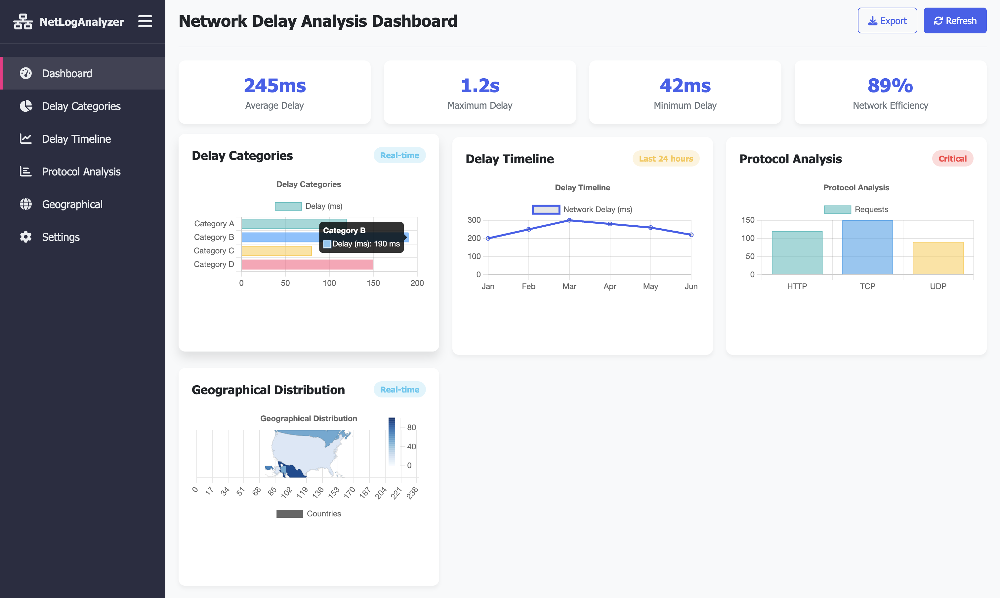

# Hackenza Proposal | Team Vicodin

## Problem Statement

Characterisation of Delays in Packet Transmission

## Approach

We plan to tackle the problem in three phases:

### Research Phase

Root cause analysis for network delays lies at the heart of the problem statement. Acknowledging that our team isn’t the best versed with networks, our very first step would be to catch ourselves upto speed with some networks theory. Through this phase, we aim to acclimatise ourselves with various delay /jitter detection algorithms. We have shortlisted the following resources for the same:

- Packet Vs. Flow: A Look at Network Traffic Analysis Techniques - [https://www.liveaction.com/resources/solution-briefs/packet-vs-flow-a-look-at-network-traffic-analysis-techniques/](https://www.liveaction.com/resources/solution-briefs/packet-vs-flow-a-look-at-network-traffic-analysis-techniques/) (Article)
- Analysis of End-to-End Packet Delay for Internet of Things in Wireless Communications - [https://thesai.org/Downloads/Volume9No9/Paper_44-Analysis_of_End_to_End_Packet_Delay.pdf](https://thesai.org/Downloads/Volume9No9/Paper_44-Analysis_of_End_to_End_Packet_Delay.pdf) (Research Paper)
- Measurement of Internet Access Latency: A Cross-Dataset Comparison - [https://papers.ssrn.com/sol3/papers.cfm?abstract_id=4909679](https://papers.ssrn.com/sol3/papers.cfm?abstract_id=4909679) (Research Paper)
- Response Time Analysis for RT-MQTT Protocol Grounded on SDN - [https://drops.dagstuhl.de/storage/01oasics/oasics-vol108-ng-res2023/OASIcs.NG-RES.2023.5/OASIcs.NG-RES.2023.5.pdf](https://drops.dagstuhl.de/storage/01oasics/oasics-vol108-ng-res2023/OASIcs.NG-RES.2023.5/OASIcs.NG-RES.2023.5.pdf) (Research Paper)
- Correlation Analysis of MQTT Loss and Delay According to QoS Level - [https://ieeexplore.ieee.org/document/6496715](https://ieeexplore.ieee.org/document/6496715) (Research Paper)
- What is Log Analysis? Process, Techniques, and Best Practices - [https://www.exabeam.com/explainers/log-management/what-is-log-analysis-process-techniques-and-best-practices/](https://www.exabeam.com/explainers/log-management/what-is-log-analysis-process-techniques-and-best-practices/) (Article)
- What is Log Analysis? Overview and Best Practices - [https://www.logicmonitor.com/blog/log-analysis](https://www.logicmonitor.com/blog/log-analysis) (Article)
- Delay and Energy Consumption of MQTT over QUIC: An Empirical Characterisation Using Commercial-Off-The-Shelf Devices  - [https://www.mdpi.com/1424-8220/22/10/3694](https://www.mdpi.com/1424-8220/22/10/3694) (Research Paper)

### Development Phase

Having gained some familiarity with the domain of networks, we will implement the network delay analyser in the development phase.

We plan to implement the tool in a multi-view fashion, with each view catering to a network access level (user / admin). These views will not function as actual access controls, and will be unique to each ‘user’ of the application; we are not implementing a system where we have multiple users of the application assigned user / admin roles. Instead, once each user uploads their data, they will be able to access multiple dashboards.

The admin dashboard will provide a comprehensive, global analysis of the entire network, including delays originating from all nodes of the network. The user dashboard, on the other hand, will offer a personalised view displaying processed data corresponding to a particular source. The isolation of information into admin and user views is one of our elements of novelty, and will serve as an effective analysis tool. Once a pattern of delays has been identified using the admin view, the user can dig deeper into the root cause analysis by viewing individual network nodes / node groups.

We also plan to implement custom classification and filtering rules. While we will provide as comprehensive a list of presets as we are, we will also allow application users to alter these defaults per their convenience. 

The backend will handle file uploads and processing using Python. When a `.pcapng` file is uploaded, it will be stored temporarily before being parsed with packet analysis tools to extract essential metrics such as timestamps, IP addresses, and delay indicators. Custom filtering routines will then isolate data relevant only to a particular user. This preprocessed data will be structured and stored in our time-series database, InfluxDB, which will serve as the backbone for real-time analysis and reporting.

Following preprocessing, custom detection algorithms will analyse the filtered data to pinpoint network delays and potential causes - whether these are due to retransmissions, congestion, or other factors. The analytical results, both for admins and users, will be visualised using Grafana dashboards, which will be integrated into our portal. This approach provides dynamic, interactive views allowing continuous monitoring.

### Testing and Deployment Phase

With the conclusion of the development phase, we will have a fully functional network delay analysis tool, which can be run locally on the user’s machine. The focus of the testing and deployment phase would be to extend the functionalities of this tool in a scalable and efficient manner.

In this phase, we plan to perform an optimisation pass through the entire analysis pipeline, addressing any potential performance issues. Once every element of the broader system (primarily upload handling, data processing, visualisation) has been validated with sample data, we will deploy our application to a cloud platform with appropriate measures to ensure scaling and availability.

## Additional Details

### Summary of Our Tech Stack

| Component | Technology of Choice |
| --- | --- |
| Packet Capture (for testing) | Wireshark |
| Packet Parsing | Scapy |
| Backend  | Python (FastAPI or Flask) |
| Data Storage | InfluxDB |
| Frontend Framework | React.js |
| Visualisation | Grafana |

### Tentative UI Design and Layout

## The Team

- Manit:
    - Working at DaSH Lab in the domain of Federated Learning (FL) since sem 1, 2023, and Machine Learning, specifically Vision Transformers since sem 1, 2024. Project Co-Lead for SAM (Segment Anything Model) project.
    - Proficient in python, with experience in working with large codebases.
    - Currently enrolled in the Network Programming Course taken by Vinayak sir.
- Bhavya:
    - Working at DaSH Lab in the domain of Parallel File Systems (PFS) since sem 1, 2023, and Machine Learning, specifically Vision Transformers since sem 1, 2024. Project Co-Lead for the PFS and SAM projects.
    - Proficient in python, with experience in working with services such as Grafana, InfluxDB, Prometheus and Telegraf.
    - Currently enrolled in the Network Programming Course taken by Vinayak sir.
- Ananya:
    - Proficient in front-end development using ReactJs and back-end development using MongoDB.
    - Experience in Python programming; was a part of the special project 'BITS Auto' under the guidance of Prof. Neena.
- Tejas:
    - Experience in Python programming; was a part of the special project 'BITS Auto' under the guidance of Prof. Neena.
    - Worked on creating an object detection model using YOLO for an autonomous underwater vehicle.
    - Working on implementing the DSOR-Farol stack for the simulation of a swarm of underwater vehicles in gazebo.
